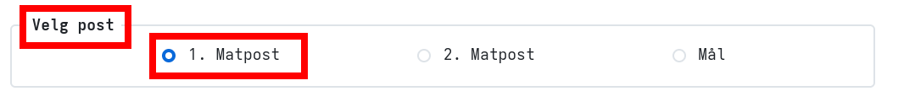
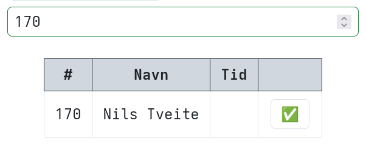
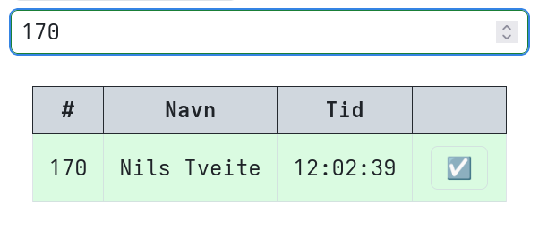
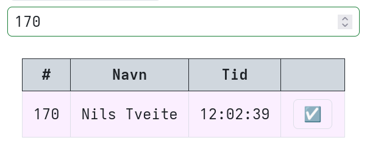
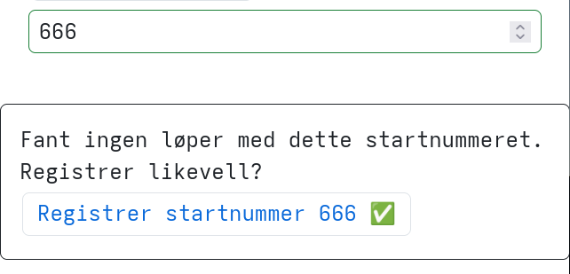

% Bruksinstruks Elektronisk Kadaver Tidtakningssystem

# Hvordan funker skitet?
Elektronisk Kadaver Tidtakningssystem (EKT) lar matpostpersonell registrere tidspunkt løpere ankommer på gjennom Internett.
All dataen er lagra i tekstfiler. 

db.csv har alle løperene og passering.csv har alle registreringene gjort på matpost og i mål. php koden kverner dette og spytter ut resultatlister og diverse.

Når du registrerer en løper vil en ny linje bli lagt til i passering.csv. Registrerer du eller noen andre samme person på samme matpost igjen vil den siste registreringa gjelde. Det betyr i praksis at det ikke er mulig å gjøre noe galt siden ingenting blir skrevet over eller sletta. Trykker man feil blir i verste fall en mellomtid feil og dette kan enkelt rettes opp i etter løpet.

# I Praksis
Gå til [ekt.trygve.net/admin.php](https://ekt.trygve.net/admin.php)

Blir du bedt om å logge inn skriver du inn et vilkårlig brukernavn og passordet du fikk av løpsleder.

Skal du registrere passeringer trykker du på denne knappen:

Det første du må gjøre er å velge hvilken matpost du står på. Husk å bytte dette hvis du flytter til en annen matpost/mål

Når en løper skal registreres skriver du inn startnummeret. Løperens navn skal da dukke opp og du trykker på ✅️

Etter løperen har passert matposten blir bakgrunnen grønn:

Har løperen passert en senere matpost eller mål blir bakgrunnen lilla.

Har det skjedd en feil og startnummeret ikke ligger i systemet får du valget å registrere den likevell. Tida blir lagra, men vill ikke dukke opp i resultatlista før løperen blir registrert i databasen. Det er derfor lurt å spørre løperen om hva han/hun heter og skrive det ned.
